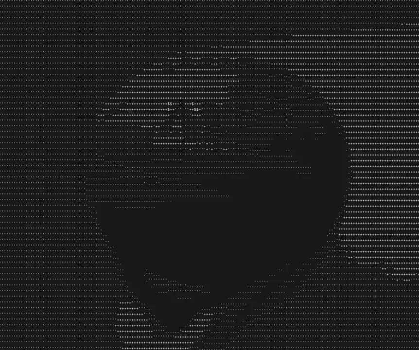

## asciicam

An ascii webcam in your console, written as a way of learning rust.

 <br/>
_asciicam picture of me holding a basketball_

## usage

```console
$ git clone https://github.com/vilhelmbergsoe/asciicam && cd asciicam/
$ cargo build --release
$ ./target/release/asciicam
```

## keybindings

`q` => quit

`s` => save ascii picture

## license

[MIT](https://choosealicense.com/licenses/mit/)
